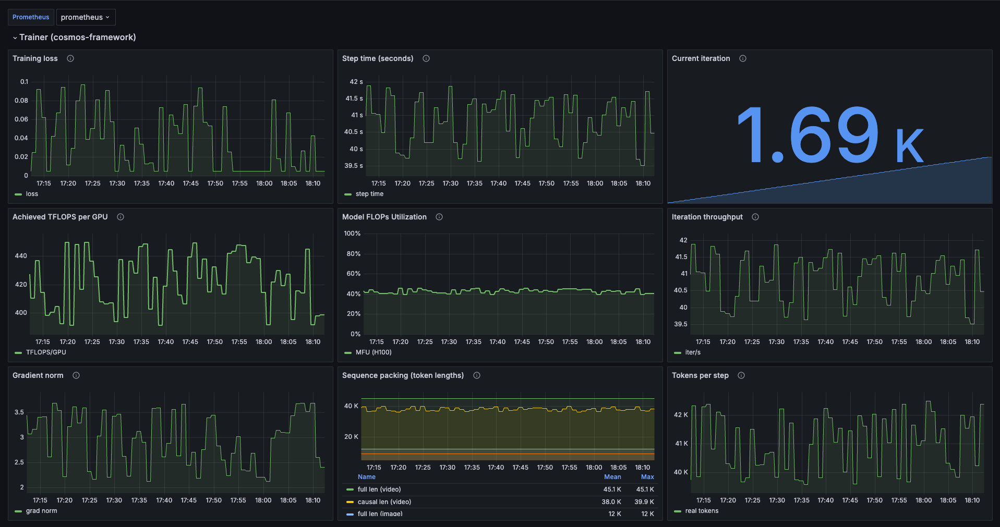
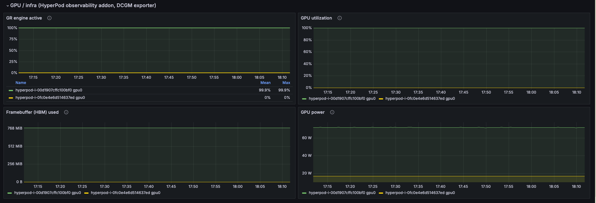

<!-- Copyright Amazon.com, Inc. or its affiliates. All Rights Reserved. -->
<!-- SPDX-License-Identifier: MIT-0 -->

# Cosmos 3 Observability — Framework-Metrics Dashboard & Prerequisites

This directory ships a reproducible **goodput metrics harness** for the Cosmos 3
sample on Amazon SageMaker HyperPod (EKS): a Grafana dashboard plus the steps to
wire up the cosmos-framework training metrics behind it.

- [`cosmos3-goodput-dashboard.json`](./cosmos3-goodput-dashboard.json) — an
  importable Grafana dashboard model (Amazon Managed Grafana compatible) titled
  **"Cosmos 3 Goodput (AWS HyperPod)"**.

> **Validated on:** the OTLP trainer-metrics export path below was functionally
> validated on a **2× g6.8xlarge HyperPod-EKS cluster (us-east-1)** — DCGM/GPU
> metrics and the `cosmos3_*` framework metrics were observed together in a
> single AMP workspace and unified in one Grafana pane.

## What this dashboard adds

The HyperPod observability addon **already** ships DCGM/GPU dashboards (e.g. the
built-in **"Cluster"** dashboard) from its DCGM exporter and node exporters.
What **this** dashboard adds is the **cosmos-framework training metrics** —
MFU, iteration throughput, gradient norm, sequence packing, tokens-per-step,
loss and step time — unified with a small GPU correlation strip, all on a single
Amazon Managed Prometheus (AMP) datasource template variable (`${DS_PROMETHEUS}`).

| Section | Source | Metrics → Panels |
| --- | --- | --- |
| **Trainer (cosmos-framework)** *(the differentiator)* | Shipped `OTLPCallback` + the wandb→OTLP bridge → AMP | `cosmos3_loss`, `cosmos3_step_time_seconds`, `cosmos3_iteration`, `cosmos3_mfu_achieved_tflops_per_gpu`, `cosmos3_mfu_h200`/`cosmos3_mfu_h100`, `cosmos3_timer_iter_speed`, `cosmos3_clip_grad_norm_video_global`, `cosmos3_sequencepackingpadding_*`, `cosmos3_data_stats_tokens_avg_num_real_tokens` |
| **GPU / infra** *(correlation strip)* | HyperPod observability addon (DCGM exporter) → AMP | `DCGM_FI_PROF_GR_ENGINE_ACTIVE`, `DCGM_FI_DEV_GPU_UTIL`, `DCGM_FI_DEV_FB_USED`, `DCGM_FI_DEV_POWER_USAGE` |

The two panes below are an illustrative capture from a single run, not a benchmark
result to read numbers off of. The first pane is the **Trainer (cosmos-framework)**
view — training loss, step time, achieved TFLOPS per GPU, Model FLOPs Utilization
(here against the framework's default per-GPU peak), iteration throughput, gradient
norm, and sequence-packing token lengths — all bridged from the framework callbacks:



The second pane is the **GPU / infra** view from the HyperPod observability addon
(via the DCGM exporter) — graphics-engine-active, GPU utilization, framebuffer (HBM)
used, and GPU power, reported per GPU so an idle or under-driven device is visible:



## How framework metrics reach AMP (OTLP)

The diagram below traces both metric sources into a single AMP workspace and one
Grafana pane. The cosmos-framework callbacks reach AMP through the sample's OTLP
callback and wandb→OTLP bridge, while the add-on's DCGM exporter contributes the
GPU/infra metrics — the two converge on the add-on's existing remote-write pipeline.


The trainer metrics are emitted by the cosmos-framework callbacks and exported
to AMP via **OpenTelemetry OTLP**, straight into the HyperPod observability
addon's OTLP receiver (which is already wired into the same remote-write→AMP
pipeline). No Pushgateway, no collector-config edit — durable across addon
upgrades. The OpenTelemetry deps (`opentelemetry-sdk` + OTLP grpc/http
exporters) are already baked into the sample Dockerfile.

Set a single env var on the training pod / job spec to enable everything:

```bash
export OTEL_EXPORTER_OTLP_ENDPOINT="http://hyperpod-otel-collector.hyperpod-observability.svc:4317"
export OTEL_EXPORTER_OTLP_PROTOCOL="grpc"   # grpc (4317) or http (4318)
```

The OTLP receiver lives in the `hyperpod-observability` namespace as service
`hyperpod-otel-collector`, ports `4317` (grpc) / `4318` (http).

Setting `OTEL_EXPORTER_OTLP_ENDPOINT` activates **three** things in lockstep
(all gated on that one env var; the default path is untouched):

1. **`OTLPCallback`** — exports the three core trainer scalars (loss, step time,
   iteration) directly to the OTLP receiver.
2. **The wandb→OTLP bridge** — wraps `wandb.log` so every numeric scalar the
   framework callbacks log (MFU, throughput, grad-norm, sequence packing,
   data-stats, ...) is mirrored to OTLP gauges too.
3. **The MFU + sequence-packing framework callbacks** — enabled in the
   experiment so those richer metrics are actually produced. (`iter_speed` and
   `grad_clip` are already enabled in the experiment.)

> **Overhead note:** enabling `MFUCallback` adds minor per-step FLOPs-accounting
> overhead. It is gated on observability being on, so the default path pays
> nothing.

Optional env: `PROMETHEUS_JOB_NAME` (OTLP `service.name`, default `cosmos3`) and
`PROMETHEUS_EVERY_N` (export every N steps).

### MFU peak-TFLOPS (`COSMOS3_PEAK_TFLOPS`)

The framework's `MFUCallback` defaults its hardware target to H100's peak
(989 TFLOPS) on non-Blackwell accelerators, which is the **wrong denominator on
p5en / H200** and skews the MFU ratio. Set the correct H200 peak (per precision)
so the ratio is computed correctly:

```bash
export COSMOS3_PEAK_TFLOPS="1979"   # H200 peak TFLOPS; set per precision
```

When set, the MFU ratio series is exported as `cosmos3_mfu_h200`; otherwise the
framework default `cosmos3_mfu_h100` is used. The dashboard's
**"Model FLOPs Utilization"** panel queries both, so whichever exists is shown.

**Fallback (no OTLP receiver available):** run with `wandb_mode=offline` — the
same metrics are captured locally for later inspection.

> **Warm-up thresholds (short runs).** The framework's `MFUCallback` skips its
> first few iterations (`hit_thres=5`) before it begins reporting, and
> `IterSpeed` only logs `timer/iter_speed` after **50** iterations
> (`hit_thres=50`). A short smoke (≤ ~30 iters) will surface MFU, sequence
> packing and grad-norm but **not** `cosmos3_timer_iter_speed` — run ≥ 51
> iterations to see it. With `wandb_mode=offline`, all of these are still
> captured to the local wandb datastore regardless.

## Prerequisites & setup

### 1. Enable the HyperPod observability addon (Terraform)

Use the existing IaC at
[`1.architectures/7.sagemaker-hyperpod-eks/terraform-modules/hyperpod-eks-tf/`](../../../../1.architectures/7.sagemaker-hyperpod-eks/terraform-modules/hyperpod-eks-tf/).
Do **not** re-ship infra — set these variables:

```hcl
create_observability_module = true   # installs amazon-sagemaker-hyperpod-observability addon + AMP + Managed Grafana
create_prometheus_workspace = true   # creates the AMP workspace (default)
enable_gpu_operator         = false  # IMPORTANT: leave false on the observability path
```

- **Confirm your region is AMP-allowed.** `create_observability_module` is gated
  on an AMP-supported region. Allowed regions include: `us-east-1`, `us-east-2`,
  `us-west-1`, `us-west-2`, `ap-south-1`, `ap-northeast-1`,
  `ap-southeast-1/2/3/4`, `eu-central-1`, `eu-west-1/2`, `eu-north-1`,
  `eu-south-2`, `sa-east-1`.
- **Leave `enable_gpu_operator = false`.** The observability addon bundles its
  **own** DCGM exporter. Enabling the GPU operator stands up a **second,
  duplicate** DCGM exporter and produces conflicting/duplicated GPU series.

### 2. Confirm the Kubeflow Training Operator is present

HyperPod managed auto-resume relies on the Kubeflow Training Operator
(**1.7.0 / 1.8.0 / 1.8.1**). This is already a sample prerequisite — see the
[hyperpod-eks README](../hyperpod-eks/README.md) for the install/verify steps.

### 3. Activate framework metrics

Set `OTEL_EXPORTER_OTLP_ENDPOINT` (and optionally `COSMOS3_PEAK_TFLOPS`) on the
training pod — see [How framework metrics reach AMP (OTLP)](#how-framework-metrics-reach-amp-otlp).

### 4. Import the dashboard into Amazon Managed Grafana

1. Open your Amazon Managed Grafana workspace → **Dashboards → New → Import**.
2. Upload [`cosmos3-goodput-dashboard.json`](./cosmos3-goodput-dashboard.json).
3. When prompted for the `DS_PROMETHEUS` input, select your **AMP** datasource.
4. Save. The framework section populates once a training job is running with the
   OTLP endpoint set; the GPU strip populates from the addon's DCGM exporter.

### 5. Experiment tracking (out of scope here)

For experiment tracking, SageMaker MLflow integrates separately via the
Terraform `enable_mlflow` variable. It is **out of scope** for this goodput
observability harness — pointer only.
